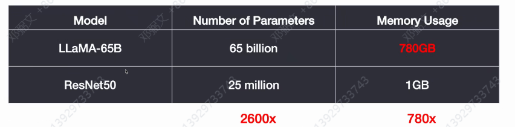

# Day1

## 大模型的发展历史

各个时间点

## AI model compare

1. Prompt Engineering 提示工程
2. Agents 智能体
3. Fine-tuning 微调
4. Pre-training 预处理

## Prompt Engineering

从与人沟通转变成优先与大模型沟通，比90%同事给的内容要好得多

在和大模型沟通时候，耐心多给一些提示就能大模型举一反三

### Prompt的演进

朴素的日报

多添加提示

更换角色，但要求写类似的日报，大模型有记忆，能用之前的Q&A来生成后面的回答

提示工程的核心就是将手动的转成自动的，例如上面的更换角色，这里的角色相当于是一个输入的参数，上下文则是一个函数，每次问大模型时候，只需要一个参数就你根据上下文自动生成。

## AI Agents

AI Agents类似终结者，核心是把大模型当作人的大脑，自己能解决的就按自己的思维推断出步骤，自己不能解决的则需要借助传感器来帮助自己解决。

例如，问chatgpt3.5模型 2023奥运会的问题时候，大模型一开始是不知道的，因为3.5是在2023之前训练完的，这时候需要通过网络来获取答案。

AI Agents这个大脑包括的功能

1. Planning
2. Memory
3. Tools

智能代理分类

1. 行为代理，旨在决定执行序列
2. 模拟代理，在模拟环境中进行
3. 自主智能体，旨在独立执行以实现长期目标

RAG

### 大模型微调 Fine-tuning

模型就类似y=wx

大模型就是大量的参数X

为什么要微调？

预训练成本高

提示工程有天花板

基础模型缺少特定领域数据

数据安全和隐私

个性化服务需要特定和模型

open AI的迭代也是从预训练到微调

大模型微调技术路线

+ 全量微调

  把全部参数都加载进来微调，训练成本高且可能会灾难性遗忘

+ 高效微调
  + 有监督微调，打tag
  + 指令微调，像训练小狗让它记住输入什么就要做上面事
  + 基于人类反馈的强化学习

### 预训练

LLaMA

## 生成式

OpenAI年度总结

Gemini的超长上下文模型，开源版本是Gemma

大模型的知识量是远超人类的

## 未来趋势

1. 新架构的探索，研究者将探索新的，以提升处理速度，降低计算成本，提高模型的泛化能力
2. 模型压缩和优化，目的减少模型的大小，和提升运行效率
3. 自动化模型设计
4. 跨模态

## 挑战

1. 架构创新的复杂性
2. 适配新架构的微调技术
3. 模型的可解释性
4. 迁移学习的挑战
5. 伦理和社会责任

## AI创投案例

Pika，能生成和编辑3D动画、动漫

Scale AI

在金融和银行领域的应用场景，这个领域要求的信息很高

通用模型和领域垂类模型

## 基于GPT的Prompt技巧的最佳实践

+ 角色设定，使用gpt时候不要用其他指代词，用User、System、Assitant。其他代词指男朋友、女朋友、家人、儿子这些能让gpt理解的词。如果设置来这些词，当挑战gpt身份时候，gpt就会露出马脚。
+ 指令注入
+ 问题拆解
+ 分层设计
+ 编程思维
+ Few-Shot

# 大预言模型理论基础与技术发展

## 语言模型技术各个阶段

1. 统计语言模型

   初期的语言模型，依赖于统计分布和频率来预测单词。起源于信息论和早期计算机科学。

2. 神经网络语言模型

3. 基于Transformer大语言模型

## 注意力机制

在NLP、CV、推荐系统有明显提升

## Transformer

## BERT vs GPT

## GPT1到GPT3

# Day2

## Token计算和计费

1000个token大约相当于750个单词，实际一个token就是一个单词，但由于标点符号也算一个token

## OpenAI GPT API 实践

## 多模态

gpt-4o将全部多模态都整合到了一起

1. 图片识别，gpt-4v
2. 文生图，dell-e
3. 文生音，tts
4. 音生文，whisper